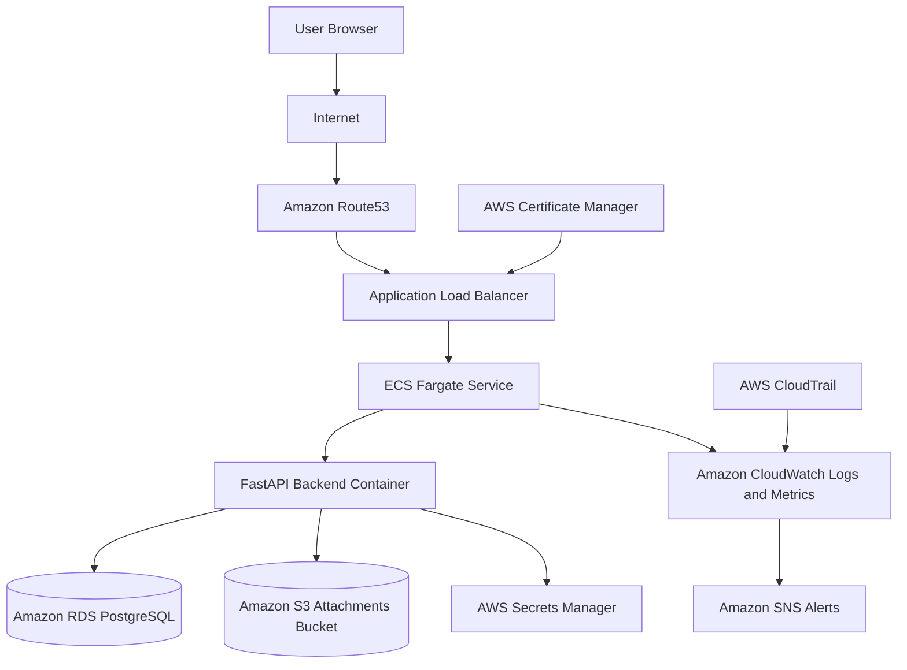

# Architecture

## Purpose

This document describes the target production architecture for Cloud Task Manager.

The application is simple, but the infrastructure is designed to show professional cloud engineering practices: secure networking, managed services, infrastructure automation, CI/CD, monitoring, and operational readiness.

## Target Architecture

## Main Components

### Route53

Route53 will manage the custom domain name for the application.

Why it matters: users should access the application through a stable domain instead of an AWS-generated load balancer address.

### AWS Certificate Manager

ACM will provide the TLS certificate used for HTTPS.

Why it matters: production applications should encrypt traffic between users and the application.

### Application Load Balancer

The Application Load Balancer will receive public HTTPS traffic and forward valid requests to ECS tasks.

Why it matters: the load balancer gives us health checks, routing, TLS termination, and a stable entry point for the service.

### ECS Fargate

ECS Fargate will run the containerized FastAPI backend without us managing EC2 servers.

Why it matters: Fargate is a managed container platform. It lets us focus on service deployment, scaling, health checks, logs, and networking.

### Amazon RDS PostgreSQL

RDS will host the PostgreSQL database.

Why it matters: production databases need backups, encryption, monitoring, maintenance windows, and private network access.

### Amazon S3

S3 will store optional task attachments.

Why it matters: files should not be stored inside containers. Containers are temporary and can be replaced at any time.

### AWS Secrets Manager

Secrets Manager will store sensitive values such as database credentials.

Why it matters: secrets should not be committed to Git, stored in Docker images, or hardcoded in Terraform.

### CloudWatch

CloudWatch will collect logs, metrics, alarms, and dashboards.

Why it matters: engineers need visibility into failures, performance, availability, and application behavior.

### SNS

SNS will send alert notifications.

Why it matters: production systems need a way to tell engineers when something is unhealthy.

### CloudTrail

CloudTrail will record AWS account activity.

Why it matters: engineers and security teams need audit logs showing who changed what and when.

## Network Design

The application will run inside a VPC.

Planned subnet model:

- Public subnets: load balancer and internet-facing routing.
- Private application subnets: ECS tasks.
- Private database subnets: RDS database.

The database will not be publicly accessible.

Security group direction:

- Internet can reach the load balancer on HTTPS.
- Load balancer can reach ECS tasks on the backend application port.
- ECS tasks can reach RDS on PostgreSQL port 5432.
- ECS tasks can reach S3 and Secrets Manager as required.
- No direct public access to RDS.

## Day 1 Cost Position

No AWS resources are created on Day 1.

Current estimated AWS cost: 0.

Before creating AWS resources in later stages, we will review purpose, cost, Free Tier eligibility, cleanup steps, and Terraform destroy steps.

