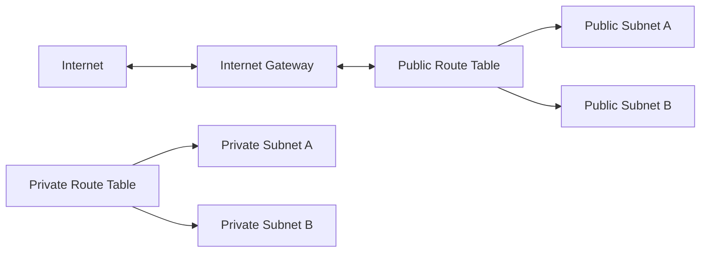

# Day 5: AWS Networking In The Console

## Objective

Build and understand the AWS network manually before reproducing it with Terraform.

The network provides a public entry tier for a future Application Load Balancer and a private application tier for future ECS tasks and RDS databases.

## Account And Cost Guardrails

- Root-user access is protected with a hardware security key and is reserved for account-level tasks.
- Daily administration uses the `cloud-admin` IAM user through the `cloud-admins` group.
- The IAM user has its own MFA security key.
- A monthly AWS budget named `cloud-learning-monthly` is set to 5 USD with email notifications.
- Workload and CI/CD identities will use least-privilege roles instead of administrator access.
- GitHub Actions will authenticate with OIDC rather than long-lived AWS access keys.

## Network Resources

| Resource | Name | Configuration |
| --- | --- | --- |
| VPC | `cloud-task-manager-vpc` | `10.0.0.0/16` |
| Public subnet A | `cloud-task-manager-public-a` | `10.0.1.0/24`, `eu-west-2a` |
| Public subnet B | `cloud-task-manager-public-b` | `10.0.2.0/24`, `eu-west-2b` |
| Private subnet A | `cloud-task-manager-private-a` | `10.0.11.0/24`, `eu-west-2a` |
| Private subnet B | `cloud-task-manager-private-b` | `10.0.12.0/24`, `eu-west-2b` |
| Internet gateway | `cloud-task-manager-igw` | Attached to the VPC |
| Public route table | `cloud-task-manager-public-rt` | Public subnets; `0.0.0.0/0` to the internet gateway |
| Private route table | `cloud-task-manager-private-rt` | Private subnets; local VPC route only |

The two Availability Zones reduce the risk that one zone failure makes the service unavailable.

## Traffic Design

Only the public route table has a default route to the internet gateway. The private route table has no internet route, so resources in private subnets cannot receive direct internet traffic.

## Security Groups

### Load Balancer Security Group

`cloud-task-manager-alb-sg`

- Inbound TCP port `80` from `0.0.0.0/0` for the initial HTTP deployment.
- Default outbound traffic is allowed.
- HTTPS on port `443` will replace public HTTP after Route53 and ACM are configured.

### API Security Group

`cloud-task-manager-api-sg`

- Inbound TCP port `8000` only from `cloud-task-manager-alb-sg`.
- Default outbound traffic is allowed.

Referencing the load balancer security group is safer than opening the API port to the internet. Only traffic that passed through the load balancer can reach future ECS tasks.

## NAT Gateway Decision

No NAT gateway was created during this milestone.

A NAT gateway would allow resources in private subnets to initiate internet connections, but it adds hourly and data-processing charges. Before deploying ECS, the Terraform design will compare a NAT gateway with the required VPC endpoints for ECR, CloudWatch Logs, Secrets Manager, and S3.

The private subnets intentionally have no outbound internet access until that decision is implemented.

## Verification

The VPC resource map confirmed:

- Both public subnets use `cloud-task-manager-public-rt`.
- Both private subnets use `cloud-task-manager-private-rt`.
- Only the public route table connects to `cloud-task-manager-igw`.
- The automatically created unnamed main route table has no explicit subnet associations.
- No NAT gateway or public IPv4 address was created.

## Cost Position

The current VPC, subnets, route tables, internet gateway attachment, and security groups have no hourly resource charge. Data-transfer charges can apply when traffic begins to flow.

The main cost risks deliberately avoided in this milestone are NAT gateway hourly and processing charges and unused public IPv4 addresses.

Estimated current monthly infrastructure cost for these networking resources: approximately 0 USD while unused.

## Cleanup Procedure

These resources should remain available while the manual design is being studied.

Before Terraform creates the production-managed network:

1. Confirm that no application resources depend on the manual security groups or subnets.
2. Delete the manual security groups.
3. Remove custom route-table associations and delete the custom route tables.
4. Detach and delete the internet gateway.
5. Delete the four subnets.
6. Delete the VPC.

There is no `terraform destroy` command for these resources because they were created manually. Once Terraform owns the replacement infrastructure, `terraform destroy` will provide repeatable cleanup.

## Key Learning

A subnet becomes public because its route table has a route to an internet gateway, not because of its name. Security groups then control which traffic is allowed to reach resources inside those subnets.
