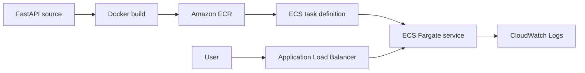

# Day 7: ECR And ECS Fargate Deployment

## Objective

Package the FastAPI backend as a production-oriented container image, store it in Amazon ECR, deploy it to Amazon ECS on AWS Fargate, verify the public health endpoint and logs, scan the image for vulnerabilities, and remove billable runtime resources after testing.

## Container Delivery Flow



Docker creates the deployable image. ECR stores and scans it. The ECS task definition describes how to run it, while the ECS service keeps the requested number of tasks running. The load balancer provides a public entry point and checks `/health` before sending traffic to a task.

## ECR Repository

The reusable `container_registry` Terraform module creates the backend repository with:

- Immutable image tags so a deployed tag cannot silently change.
- AES-256 server-side encryption.
- Vulnerability scanning on every push.
- A lifecycle policy that expires untagged images after seven days.
- Deletion protection through `force_delete = false`.

The repository remains deployed because it stores release artifacts. ECS runtime resources are controlled separately.

## Image Build And Security Improvement

The original image used `python:3.12-slim`. The first ECR scan reported 17 operating-system package findings:

- 4 Critical
- 8 High
- 5 Medium

The findings came from packages in the Debian base image rather than the FastAPI application dependencies. The base image was changed to `python:3.12-alpine3.23`, rebuilt for `linux/amd64`, and tested locally.

The Alpine image produced these results:

- `/health` returned the expected application response.
- All three backend tests passed.
- ECR Basic Scanning completed with zero findings.
- Compressed image size fell from about 59 MB to about 34 MB.

The old vulnerable ECR tags were deleted after the zero-finding image was verified.

Docker BuildKit provenance and SBOM attestations were disabled for this manual ECR Basic Scanning exercise. Without that setting, Docker produced an OCI image index that the selected scan mode could not scan. The deployable image itself remained a standard OCI image manifest.

## ECS Fargate Runtime

The reusable `container_service` Terraform module creates:

- An ECS cluster with Container Insights enabled.
- A Fargate task definition using `awsvpc` networking.
- Separate ECS execution and application task IAM roles.
- One 0.25 vCPU and 512 MiB task by default.
- A read-only container root filesystem.
- An init process and a 30-second container stop timeout.
- A seven-day CloudWatch log group with blocking log delivery.
- An ECS service with deployment rollback and a 60-second health-check grace period.

The execution role lets the ECS agent pull the image and publish logs. The task role is intentionally separate and currently has no AWS API permissions because the application does not yet call AWS services.

## Load Balancing

The Application Load Balancer is internet-facing and uses both public subnets. It forwards HTTP port 80 traffic to container port 8000 through an IP target group.

The target group:

- Checks `/health` for HTTP 200 responses.
- Uses a 30-second deregistration delay.
- Registers private Fargate task IP addresses.

Public HTTP is temporary for the learning deployment. A later security stage will add a domain, an ACM certificate, and HTTPS.

## Private Task Networking

Fargate tasks run in both private subnets with public IP assignment disabled. No NAT gateway is used.

When the runtime is enabled, Terraform creates the private AWS service paths required for startup:

- `ecr.api` interface endpoint for ECR API operations.
- `ecr.dkr` interface endpoint for Docker registry operations.
- `logs` interface endpoint for CloudWatch Logs.
- S3 gateway endpoint because ECR image layers are stored in S3.

The interface endpoint security group accepts HTTPS only from the API task security group. This keeps image pulls and log delivery on private AWS networking.

## Cost-Controlled Deployment Toggle

The development root module uses:

```hcl
deploy_container_runtime = false
```

by default. With the default value, Terraform does not deploy the hourly billed load balancer, Fargate service, CloudWatch runtime, or interface endpoints. Enabling the runtime also requires a non-empty immutable `container_image_tag`.

This separation lets the low-cost ECR repository and networking foundation remain available while the runtime exists only during planned exercises.

## Deployment Workflow

The main workflow was:

```bash
export AWS_PROFILE=terraform

terraform -chdir=infrastructure/environments/dev init
terraform -chdir=infrastructure/environments/dev validate

terraform -chdir=infrastructure/environments/dev plan \
  -var='deploy_container_runtime=true' \
  -var="container_image_tag=$IMAGE_TAG" \
  -out=.terraform/ecs.tfplan

terraform -chdir=infrastructure/environments/dev apply \
  .terraform/ecs.tfplan
```

After verification, returning to the default configuration planned the runtime cleanup:

```bash
terraform -chdir=infrastructure/environments/dev plan \
  -out=.terraform/cleanup.tfplan

terraform -chdir=infrastructure/environments/dev apply \
  .terraform/cleanup.tfplan
```

Saved plans remain inside the ignored `.terraform/` directory and must not be committed.

## Verification

- ECR foundation apply: 2 resources added.
- ECS runtime plan and apply: 16 resources added.
- ECS service reached `ACTIVE` with one desired and one running task.
- The load balancer health endpoint returned HTTP 200 and the expected JSON.
- Application startup and request logs appeared in CloudWatch Logs.
- Local backend test suite: 3 passed.
- Final Alpine ECR scan: 0 findings.
- Runtime cleanup: 16 resources destroyed.
- Final default Terraform plan: no changes.

## Current Cost Position

The following low-usage resources remain:

- The encrypted S3 Terraform state bucket.
- The ECR repository and one verified Alpine image.
- The VPC, subnets, route tables, internet gateway, and security groups, which have no hourly charge by themselves.

The following billable runtime resources are not deployed:

- Application Load Balancer.
- ECS Fargate tasks.
- Interface VPC endpoints.
- NAT gateway.
- RDS database.

The AWS budget remains enabled. ECR image storage and S3 state storage continue to incur small usage-based charges.

## Key Learning

ECR stores and scans versioned container artifacts, while ECS describes and operates those artifacts as services. A Fargate task in a private subnet needs both IAM permission and a network path to pull an image and publish logs. Deployment is not complete until health checks, service state, logs, security findings, cost impact, and cleanup have all been verified.
